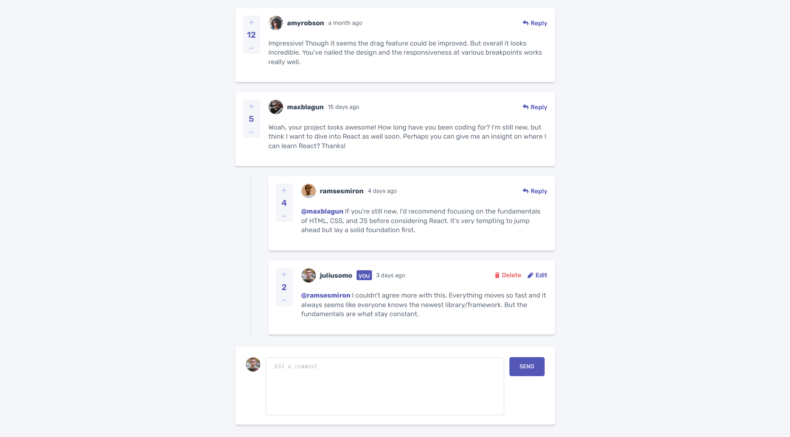
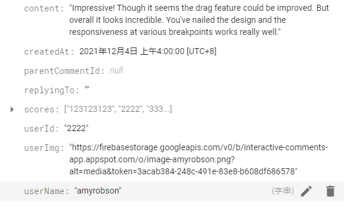

# Frontend Mentor - Interactive comments section solution

This is a solution to the [Interactive comments section challenge on Frontend Mentor](https://www.frontendmentor.io/challenges/interactive-comments-section-iG1RugEG9). Frontend Mentor challenges help you improve your coding skills by building realistic projects.

## Table of contents

- [Frontend Mentor - Interactive comments section solution](#frontend-mentor---interactive-comments-section-solution)
  - [Table of contents](#table-of-contents)
  - [Overview](#overview)
    - [The challenge](#the-challenge)
    - [Screenshot](#screenshot)
    - [Data structure](#data-structure)
    - [Links](#links)
  - [My process](#my-process)
    - [Built with](#built-with)
    - [Useful resources](#useful-resources)

## Overview

### The challenge

Users should be able to:

- View the optimal layout for the app depending on their device's screen size
- See hover states for all interactive elements on the page
- Create, Read, Update, and Delete comments and replies
- Upvote and downvote comments
- **Bonus**: If you're building a purely front-end project, use `localStorage` to save the current state in the browser that persists when the browser is refreshed.
- **Bonus**: Instead of using the `createdAt` strings from the `data.json` file, try using timestamps and dynamically track the time since the comment or reply was posted.

### Screenshot

### Data structure

### Links

- Solution URL: [https://www.frontendmentor.io/profile/yuRicky09](https://www.frontendmentor.io/profile/yuRicky09)
- Live Site URL: [https://interactive-comments-app.firebaseapp.com/](https://interactive-comments-app.firebaseapp.com/)

## My process

### Built with

- Vue3
- Vuex
- Firebase
- CSS Grid
- Mobile-first workflow

### Useful resources

- [hierarchy comment design](https://www.aleksandra.codes/comments-db-model)
- [Recursive Components](https://vuejs.org/v2/guide/components-edge-cases.html#Recursive-Components)
